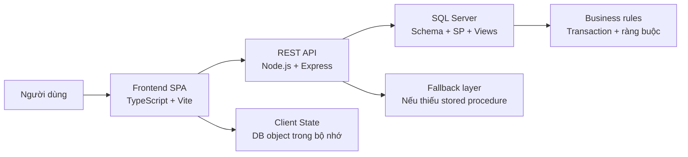
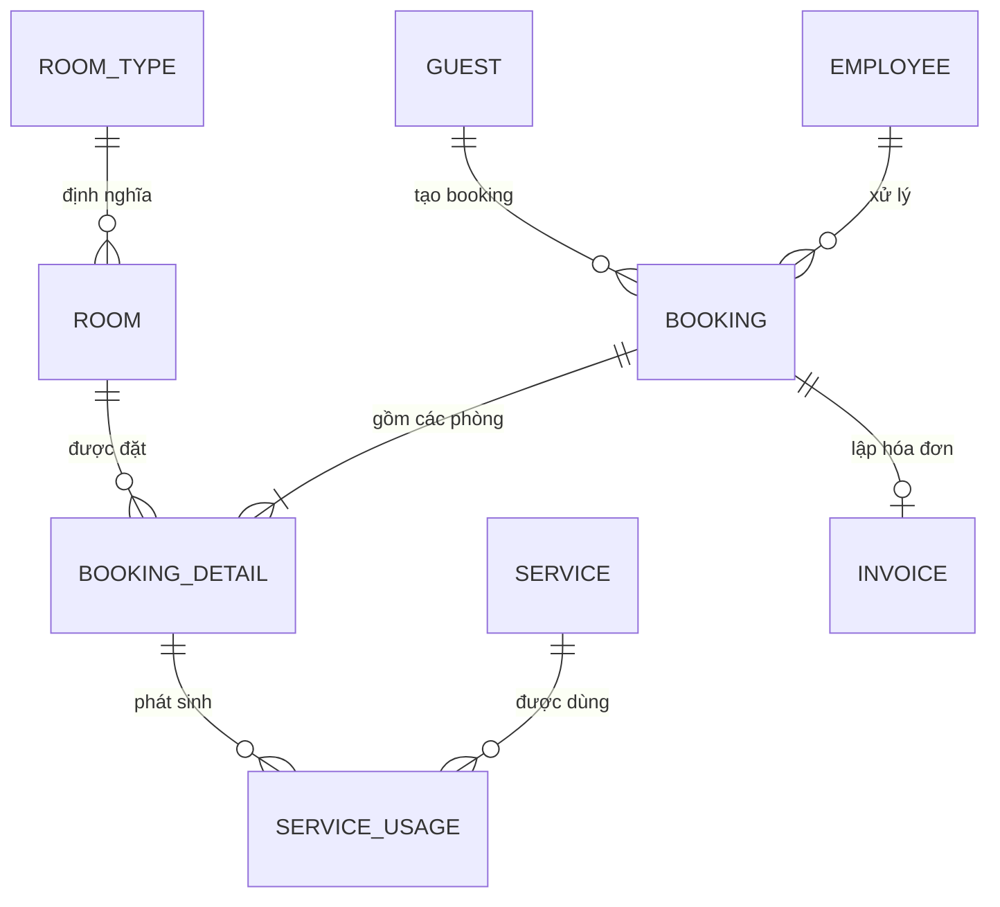

# Báo Cáo Chi Tiết Dự Án Hotel Management System

## Thông tin chung

- Tên dự án: Hotel Management System
- Nhận diện giao diện: COMUA / Khách sạn Cỏ Mưa
- Ngày khảo sát mã nguồn: 18/03/2026
- Phạm vi báo cáo: toàn bộ mã nguồn hiện có trong repository, bao gồm frontend, backend, database, giao diện trình bày và các tài liệu sinh ra trong thư mục gốc
- Cách thức khảo sát: đọc mã nguồn trực tiếp, đối chiếu giữa TypeScript, SQL và HTML/CSS, build frontend và backend để kiểm tra khả năng biên dịch

## 1. Tóm tắt điều hành

Đây là một đồ án quản lý khách sạn quy mô nhỏ đến trung bình, được xây dựng theo mô hình full-stack gồm:

- Frontend SPA viết bằng TypeScript thuần và Vite
- Backend REST API viết bằng Node.js, Express và thư viện `mssql`
- Cơ sở dữ liệu SQL Server được thiết kế rõ bằng schema, seed data, stored procedures và views

Giá trị lớn nhất của dự án nằm ở chỗ:

- Có mô hình dữ liệu khá đầy đủ cho bài toán khách sạn: phòng, loại phòng, khách, nhân viên, booking, chi tiết booking, dịch vụ, sử dụng dịch vụ, hóa đơn
- Tuân thủ khá rõ tư duy “business logic được đưa xuống database” thông qua stored procedures
- Frontend được chia thành các trang nghiệp vụ rõ ràng, đủ dùng để demo luồng vận hành khách sạn
- Dự án có seed data và giao diện trình bày, phù hợp cho mục đích học tập, demo và bảo vệ môn học

Đồng thời, code hiện tại cũng bộc lộ một số hạn chế quan trọng:

- Chưa có test tự động
- Password đang được lưu và so sánh theo dạng plain text dù tên cột là `password_hash`
- Frontend mặc định gọi API qua cổng `5001`, trong khi backend mặc định chạy cổng `5000`
- Chưa có cơ chế tránh trùng lịch đặt phòng theo ngày
- Tiền phòng hiện được tính theo tổng `price_at_booking` của các phòng, chưa nhân theo số đêm lưu trú
- Có API check-in/check-out nhưng giao diện hiện tại chưa nối nút thao tác vào quy trình này

Nếu xét trong bối cảnh đồ án môn học, đây là một sản phẩm có nền tảng kỹ thuật khá tốt, dễ mở rộng, dễ demo, nhưng vẫn cần một lớp “hardening” nữa để trở thành hệ thống sát nghiệp vụ thực tế hơn.

## 2. Toàn cảnh codebase hiện tại

### 2.1. Cấu trúc thư mục

```text
.
├── database/
│   ├── schema.sql
│   ├── seed_data.sql
│   └── stored_procedures.sql
├── server/
│   ├── package.json
│   ├── tsconfig.json
│   ├── .env
│   └── src/
│       ├── db.ts
│       └── index.ts
├── src/
│   ├── api.ts
│   ├── data.ts
│   ├── main.ts
│   ├── search.ts
│   ├── style.css
│   ├── types.ts
│   ├── ui.ts
│   └── pages/
│       ├── bookings.ts
│       ├── dashboard.ts
│       ├── employees.ts
│       ├── guests.ts
│       ├── invoices.ts
│       ├── login.ts
│       ├── rooms.ts
│       └── services.ts
├── dist/
├── index.html
├── presentation.html
├── package.json
├── tsconfig.json
├── project_report.md
└── BAO_CAO_CHI_TIET_DU_AN.md
```

### 2.2. Quy mô mã nguồn

Theo thống kê trực tiếp từ workspace:

| Khu vực | Quy mô quan sát |
| --- | --- |
| Frontend TypeScript | 2.390 dòng |
| Backend TypeScript | 930 dòng |
| SQL schema + procedures + seed | 831 dòng |
| CSS giao diện chính | 2.200 dòng |
| `index.html` | 170 dòng |
| `presentation.html` | 680 dòng |

Nếu tính cả CSS và file trình bày, tổng khối lượng artifact chính của dự án vào khoảng hơn 7.000 dòng mã nguồn/nội dung. Đây là quy mô hợp lý cho một đồ án học phần có cả giao diện, API và cơ sở dữ liệu.

### 2.3. Công nghệ sử dụng

#### Frontend

- Vite 7.3.1
- TypeScript 5.9.x
- SPA không dùng framework như React/Vue
- Hash routing tự xây dựng
- HTML template strings và DOM manipulation thủ công

#### Backend

- Node.js theo module ESM
- Express 5.2.1
- `mssql` 12.2.0
- `dotenv` 17.3.1
- `cors` 2.8.6

#### Database

- SQL Server
- 9 bảng dữ liệu
- 34 stored procedures
- 2 views
- 9 indexes

### 2.4. Kiểm tra build

Trong quá trình khảo sát:

- `npm run build` tại thư mục gốc build frontend thành công
- `npm run build` tại `server/` build backend thành công
- Frontend có cảnh báo Vite liên quan đến việc một số module vừa được import động vừa import tĩnh, nhưng không gây lỗi build
- Không phát hiện test suite trong repository

Kết luận chất lượng kỹ thuật ở mức “build được”, nhưng chưa ở mức “được bảo vệ bởi test”.

## 3. Bài toán nghiệp vụ mà dự án đang giải

Dự án hướng đến bài toán quản lý vận hành cơ bản của một khách sạn:

- Quản lý phòng và loại phòng
- Quản lý khách hàng
- Quản lý nhân viên và phân quyền cơ bản
- Tạo, xác nhận và hủy booking
- Ghi nhận sử dụng dịch vụ trong thời gian lưu trú
- Lập hóa đơn và in hóa đơn
- Theo dõi doanh thu, công suất phòng, hoạt động gần đây

### 3.1. Tác nhân hệ thống

Từ code frontend và schema, có thể thấy 4 nhóm vai trò:

| Vai trò | Quyền được mô tả trong code |
| --- | --- |
| Admin | Toàn quyền, có thể quản lý cả tài khoản Admin khác |
| Manager | Truy cập gần như toàn bộ nghiệp vụ, nhưng frontend có ràng buộc không cho sửa/xóa tài khoản Admin |
| Receptionist | Truy cập hết trừ trang nhân viên |
| Housekeeper | Chỉ truy cập dashboard và rooms |

### 3.2. Vòng đời nghiệp vụ được mô hình hóa

Hệ thống đang có ý định mô hình hóa vòng đời:

1. Tạo booking
2. Xác nhận booking
3. Check-in
4. Ghi nhận dịch vụ
5. Check-out
6. Tạo hóa đơn
7. Chuyển phòng sang trạng thái cần dọn dẹp
8. Nhân viên housekeeping cập nhật phòng về trạng thái sạch

Tuy nhiên, lưu ý quan trọng:

- B2, B3, B4, B5, B6 chưa được nối khớp hoàn toàn trên giao diện
- Một số bước tồn tại ở API và DB, nhưng chưa có nút thao tác hoặc state machine đầy đủ ở frontend

## 4. Kiến trúc tổng thể

### 4.1. Biểu đồ kiến trúc



### 4.2. Triết lý kiến trúc

Dự án theo đuổi một triết lý rất rõ:

- Frontend tập trung render, điều hướng và thao tác người dùng
- Backend đóng vai trò “cầu nối an toàn” giữa frontend và database
- Database chứa phần lớn quy tắc nghiệp vụ thông qua stored procedures

Tuy nhiên, khác với một mô hình “logic-in-database” thuần túy, backend còn có thêm một lớp `fallback`:

- Nếu stored procedure không tồn tại, backend tự thực thi raw SQL tương đương
- Cơ chế này được nhận diện qua lỗi SQL Server `2812` trong `server/src/index.ts`
- Ý nghĩa thực tế: hệ thống vẫn có thể chạy dù DB chưa cài đầy đủ stored procedures

Đây là một lựa chọn rất hay cho đồ án học phần vì:

- Giúp demo không bị “chết” vì thiếu script
- Giảm phụ thuộc tuyệt đối vào một trạng thái database
- Tạo tấm đệm vận hành khi giai đoạn setup chưa hoàn thiện

Nhưng đổi lại, có nguy cơ:

- Logic có thể bị lệch giữa stored procedure và raw SQL fallback trong tương lai
- Khi code thay đổi ở một bên, bên còn lại có thể không cập nhật đồng bộ

### 4.3. Luồng dữ liệu tổng quát

1. Frontend gọi API thông qua `apiFetch`, `apiPost`, `apiDelete`
2. Backend nhận request, bind tham số SQL bằng `request.input(...)`
3. Backend ưu tiên `execute(procedure)`
4. Nếu procedure bị thiếu, backend rơi xuống `query(...)`
5. Dữ liệu trả về dạng JSON
6. Frontend gọi `fetchDB()` để đồng bộ lại `DB` trong bộ nhớ
7. Các trang render lại dựa trên `DB`

## 5. Tầng frontend: phân tích chi tiết

### 5.1. Frontend được xây dựng như một SPA thuần

Đây là một điểm kỹ thuật rất đáng chú ý: dự án không dùng framework component thông dụng mà dùng TypeScript thuần với:

- Một `index.html` làm shell tổng
- Một `main.ts` làm router và bộ điều phối
- Các file `pages/*.ts` trả về HTML string
- Các hàm `init...Events()` để bind event sau mỗi lần render

Kiểu tổ chức này có ưu điểm:

- Nhẹ, dễ đọc, dễ giải thích trong môn học
- Không bị “over-engineer”
- Rất hợp với bài toán CRUD và dashboard có quy mô vừa

Nhưng cũng có những điểm cần lưu ý:

- Mỗi lần render lại, cần bind sự kiện lại thủ công
- Dễ gây ra bug nếu quên re-bind sau khi thay `innerHTML`
- Khó mở rộng về sau nếu số trang và mức độ tương tác tăng mạnh

### 5.2. `index.html`: bộ khung giao diện tổng

`index.html` chứa:

- Sidebar điều hướng
- Top bar
- Ô tìm kiếm toàn cục
- Nút theme
- Dropdown thông báo
- Vùng `pageContainer` để đổ nội dung từng trang
- Modal overlay
- Toast container

Phần logo và thương hiệu hiện tại là:

- Text logo: `COMUA`
- Trong hóa đơn in ấn: `Khách sạn Cỏ Mưa`

Điều này cho thấy dự án đã có ý thức về nhận diện thương hiệu giao diện, không chỉ là một dashboard kỹ thuật thuần túy.

### 5.3. `main.ts`: router, auth guard và khởi động ứng dụng

`src/main.ts` là bộ não của frontend:

- Định nghĩa page registry
- Quản lý route qua `window.location.hash`
- Kiểm tra đăng nhập
- Kiểm tra phân quyền trước khi vào trang
- Điều chỉnh giao diện cho trang login và trang nội bộ
- Cập nhật sidebar theo role
- Cập nhật user card
- Tải dữ liệu từ API trước lần render đầu tiên

Một số đặc điểm đáng chú ý:

- Route mặc định là `dashboard`
- Nếu chưa đăng nhập, mọi route sẽ bị đẩy về `login`
- Nếu đã đăng nhập mà vào `login`, sẽ bị đẩy ngược về `dashboard`
- Housekeeper nếu đăng nhập thành công sẽ được đưa thẳng đến `rooms`

### 5.4. `data.ts`: state management cực đơn giản nhưng hiệu quả

File `src/data.ts` giữ một object toàn cục tên `DB`, chứa:

- `roomTypes`
- `rooms`
- `guests`
- `employees`
- `bookings`
- `bookingDetails`
- `services`
- `serviceUsages`
- `invoices`

`fetchDB()` sẽ gọi song song 9 endpoint GET để đồng bộ tất cả dữ liệu.

Đây là mô hình “in-memory snapshot”:

- Đơn giản để trình bày
- Hiệu quả với quy mô dữ liệu nhỏ
- Phù hợp bài toán môn học

Đồng thời nó có một hành vi để demo rất dễ thương:

- Nếu API lỗi, `lastFetchError` được lưu lại
- Frontend không crash ngay
- Dashboard có thể hiện cảnh báo “không tải được dữ liệu”

Nghĩa là dự án được viết với tinh thần “cố gắng sống sót khi hệ thống hậu trường gặp vấn đề”.

### 5.5. `api.ts`: lớp giao tiếp API

File này rất gọn nhưng khá quan trọng:

- `VITE_API_URL` nếu được cung cấp sẽ được ưu tiên
- Nếu không có, frontend mặc định gọi `http://localhost:5001/api`
- Có xử lý đọc body lỗi để đưa ra thông báo thân thiện hơn

Rủi ro lớn nhất nằm ở đây:

- Backend mặc định mở cổng `5000`
- Frontend mặc định gọi cổng `5001`

Nếu không cấu hình biến môi trường hoặc reverse proxy bổ sung, frontend sẽ không kết nối được backend ngay sau khi clone repo.

### 5.6. `ui.ts`: bộ tiện ích dùng chung

`src/ui.ts` gồm:

- Điều hướng `navigateTo`
- Modal system
- Toast notifications
- Theme toggle
- Notification dropdown
- Quản lý đăng nhập qua `localStorage`
- Kiểm tra quyền truy cập theo role
- Hàm đổi mật khẩu

Hai ý nghĩa lớn của file này:

1. Đây là “shared UX layer” cho toàn bộ SPA
2. Cũng là nơi chứa cơ chế auth/phân quyền phía client

Lưu ý:

- `currentUser` lưu trong `localStorage`
- Chưa có JWT, session hay cookie httpOnly
- `showChangePasswordModal()` có tồn tại, nhưng hiện tại không thấy nút nào trong layout chính gọi đến nó

### 5.7. `search.ts`: tìm kiếm toàn cục

Hệ thống tìm kiếm có các đặc điểm:

- Bắt đầu tìm khi query dài từ 2 ký tự
- Tìm trong 4 nhóm: khách hàng, phòng, dịch vụ, nhân viên
- Hỗ trợ di chuyển bằng bàn phím lên/xuống/enter/escape
- Kết quả dẫn người dùng đến trang liên quan

Đây là một giá trị UX tốt vì chứng tỏ dự án không chỉ dừng lại ở CRUD cơ bản.

### 5.8. Phân tích theo từng trang frontend

#### a. Dashboard

Dashboard tổng hợp dữ liệu từ `DB` để hiện:

- Số phòng trống
- Công suất sử dụng
- Số booking đang xử lý
- Tổng doanh thu
- Danh sách booking gần đây
- Timeline hoạt động gần đây
- Sơ đồ phòng theo trạng thái

Điều hay là timeline không đọc từ bảng “notifications” riêng, mà được suy ra từ:

- `BOOKING`
- `BOOKING_DETAIL`
- `INVOICE`

Nghĩa là frontend có năng lực “tái tổng hợp thông tin từ dữ liệu nghiệp vụ” thay vì chỉ render từng bảng riêng lẻ.

#### b. Login

Trang login gọi `/api/login` để xác thực.

Ngoài ra, code hiện tại có một “offline admin bypass”:

- Username: `huydeptraivl`
- Password: `admin`

Nếu nhập cặp này, frontend sẽ tự tạo một user Admin mà không cần backend.

Đây là cách rất hữu ích để demo khi backend/DB chưa sẵn sàng, nhưng là một lỗ hổng nghiêm trọng nếu đưa lên môi trường thật.

#### c. Guests

Trang khách hàng hỗ trợ:

- Lọc theo quốc tịch
- Thêm khách
- Sửa khách
- Xóa khách

UI khá đầy đủ cho bài toán tiếp tân:

- Họ tên
- Email
- Điện thoại
- CMND/CCCD
- Quốc tịch

#### d. Rooms

Trang phòng là một trong những trang có giá trị demo cao nhất:

- Chia phòng theo tầng
- Tô màu theo trạng thái
- Click vào thẻ phòng để xem chi tiết
- Cập nhật trạng thái phòng
- Chỉnh sửa phòng
- Xóa phòng
- Thêm phòng mới
- Thêm loại phòng mới

Ngoài ra, nếu phòng đang có khách ở theo dữ liệu `BOOKING_DETAIL`, modal sẽ hiện thông tin khách đang lưu trú.

Tuy nhiên, ở đây có một điểm quan trọng:

- Người dùng có thể sửa trạng thái phòng bằng tay thành `Occupied`, `Dirty`, `Maintenance`, `Clean`
- Việc này có thể gây lệch dữ liệu so với booking/check-in nếu quy trình nghiệp vụ không được kiểm soát chặt

#### e. Bookings

Trang booking hiện tại hỗ trợ:

- Lọc theo trạng thái
- Tạo booking mới
- Xem chi tiết booking
- Xác nhận booking
- Hủy booking

Quy trình tạo booking:

1. Chọn khách hàng
2. Chọn ngày check-in / check-out
3. Chọn một hoặc nhiều phòng đang `Clean`
4. Nhập tiền cọc
5. Gửi lên backend tạo booking và booking_detail

Một nhận xét rất quan trọng sau khi đối chiếu cả frontend và backend:

- API `check-in` và `check-out` đã tồn tại
- Stored procedure `sp_CheckIn` và `sp_CheckOut` đã tồn tại
- Nhưng giao diện booking hiện tại chưa có nút thao tác check-in/check-out

Nghĩa là:

- Vòng đời nghiệp vụ được thiết kế trong backend/DB đã có
- Nhưng luồng thao tác trực tiếp trên giao diện vẫn chưa đồng bộ đầy đủ

#### f. Services

Trang dịch vụ hỗ trợ:

- Thêm dịch vụ mới
- Sửa dịch vụ
- Xóa dịch vụ
- Ghi nhận sử dụng dịch vụ
- Xem lịch sử sử dụng dịch vụ

Điều kiện để ghi nhận sử dụng dịch vụ là:

- Chỉ hiện `BOOKING_DETAIL` nào đã `actual_checkin`
- Và chưa `actual_checkout`

Do frontend hiện tại chưa nối check-in/check-out vào giao diện, tính năng này chủ yếu dựa vào:

- Seed data có sẵn
- Hoặc dữ liệu được tạo bằng cách khác bên ngoài frontend

#### g. Invoices

Trang hóa đơn hỗ trợ:

- Tổng hợp doanh thu
- Liệt kê danh sách hóa đơn
- Xem chi tiết hóa đơn mới nhất
- Tạo hóa đơn
- In hóa đơn theo mẫu HTML/CSS

Tính năng in hóa đơn được làm khá tốt:

- Sinh một vùng HTML ẩn tạm
- Đổ dữ liệu hóa đơn vào template
- Gọi `window.print()`

Đây là một điểm cộng lớn cho demo bài tập vì nó tạo cảm giác “hệ thống thực sự có sản phẩm đầu ra”.

#### h. Employees

Trang nhân viên hỗ trợ:

- Lọc theo vai trò
- Thêm nhân viên
- Sửa nhân viên
- Xóa nhân viên
- Đặt lại mật khẩu

Frontend có một logic tốt:

- Manager không được sửa/xóa tài khoản Admin
- Admin mới thấy tùy chọn tạo role `Admin`

Tuy nhiên, backend chưa có về mặt bảo mật/mạnh mẽ hoàn toàn tương ứng như frontend.

### 5.9. Design system và trải nghiệm giao diện

`src/style.css` có tới 2.200 dòng, cho thấy dự án đầu tư rất nhiều vào giao diện.

Ngôn ngữ thiết kế hiện tại:

- Glassmorphism
- Dark theme mặc định
- Có light theme
- Gradient accent
- Font `Russo One` cho logo
- Font `Inter` cho nội dung
- Background động dạng “liquid glass”

Giá trị của phần này:

- Làm project trông có gu hơn một bài CRUD thông thường
- Tạo ấn tượng khi thuyết trình
- Thể hiện dự án có cân nhắc đến tính thẩm mỹ, không chỉ logic

Một số chi tiết UX được chăm chút:

- Toast thông báo có icon theo loại
- Modal dùng chung toàn hệ thống
- Dropdown tìm kiếm toàn cục
- Notification dropdown
- Sidebar responsive cho mobile

Một số chi tiết chưa hoàn chỉnh:

- Nút `Xóa tất cả` thông báo xuất hiện trong HTML nhưng chưa thấy handler tương ứng ở TypeScript
- Hàm đổi mật khẩu có sẵn nhưng chưa được nối vào giao diện chính

## 6. Tầng backend: phân tích chi tiết

### 6.1. Cấu trúc backend

Backend rất tập trung:

- `db.ts`: cấu hình và khởi tạo kết nối SQL Server
- `index.ts`: chứa toàn bộ helper và route API

`server/src/index.ts` dài khoảng 902 dòng, nghĩa là backend hiện tại vẫn đang theo dạng “monolithic file”.

Điều này có lợi:

- Dễ đọc khi project chưa quá lớn
- Dễ demo vì tất cả route nằm trong một nơi

Nhưng về lâu dài:

- Khó bảo trì
- Khó tách test
- Dễ tạo xung đột khi nhiều người cùng sửa

### 6.2. Kết nối database trong `db.ts`

Backend đọc biến môi trường:

- `DB_USER`
- `DB_PASSWORD`
- `DB_SERVER`
- `DB_DATABASE`
- `DB_TRUST_SERVER_CERTIFICATE`
- `PORT`

Kết nối được thực hiện qua `mssql.ConnectionPool`.

Điểm tốt:

- Dùng connection pool thay vì tạo kết nối mới mỗi request
- Tách thông tin database ra `.env`
- Có tùy chọn `trustServerCertificate`

Lưu ý:

- Báo cáo này không đọc nội dung `server/.env` để tránh lộ thông tin nhạy cảm

### 6.3. Các helper backend

Trong `server/src/index.ts`, có các helper rất quan trọng:

- `executeQuery()`
- `executeQueryResult()`
- `executeProcedure()`
- `createTransactionRequest()`
- `executeProcedureOrQuery()`

Trong đó `executeProcedureOrQuery()` là một “điểm sáng kiến trúc”:

- Thử gọi stored procedure trước
- Nếu lỗi `2812`, tự động fallback sang raw SQL

Nghĩa là backend đang được xây theo hướng:

- Ưu tiên database script đầy đủ
- Nhưng không bị khóa chặt vào nó

### 6.4. Inventory API

Tổng số route quan sát được:

- 9 route GET
- 20 route POST
- 4 route DELETE
- Tổng cộng 33 route

#### Nhóm GET

| Route | Chức năng |
| --- | --- |
| `/api/rooms` | Lấy danh sách phòng kèm loại phòng |
| `/api/room-types` | Lấy danh sách loại phòng |
| `/api/guests` | Lấy danh sách khách |
| `/api/employees` | Lấy danh sách nhân viên |
| `/api/bookings` | Lấy booking |
| `/api/booking-details` | Lấy chi tiết booking |
| `/api/services` | Lấy dịch vụ |
| `/api/service-usages` | Lấy lịch sử sử dụng dịch vụ |
| `/api/invoices` | Lấy hóa đơn |

#### Nhóm POST

| Route | Chức năng |
| --- | --- |
| `/api/room-types` | Tạo loại phòng |
| `/api/bookings` | Tạo booking |
| `/api/check-in` | Check-in |
| `/api/check-out` | Check-out |
| `/api/service-usages` | Ghi nhận sử dụng dịch vụ |
| `/api/generate-invoice` | Tạo hóa đơn |
| `/api/rooms/update-status` | Cập nhật trạng thái phòng |
| `/api/rooms` | Tạo phòng |
| `/api/rooms/update` | Sửa phòng |
| `/api/guests/update` | Sửa khách |
| `/api/guests` | Tạo khách |
| `/api/employees/update` | Sửa nhân viên |
| `/api/employees` | Tạo nhân viên |
| `/api/employees/reset-password` | Đặt lại mật khẩu nhân viên |
| `/api/services/update` | Sửa dịch vụ |
| `/api/services` | Tạo dịch vụ |
| `/api/login` | Đăng nhập |
| `/api/employees/change-password` | Đổi mật khẩu |
| `/api/bookings/cancel` | Hủy booking |
| `/api/bookings/confirm` | Xác nhận booking |

#### Nhóm DELETE

| Route | Chức năng |
| --- | --- |
| `/api/rooms/:id` | Xóa phòng |
| `/api/employees/:id` | Xóa nhân viên |
| `/api/services/:id` | Xóa dịch vụ |
| `/api/guests/:id` | Xóa khách |

### 6.5. Các luồng transaction quan trọng

Backend có những transaction rõ ở các luồng:

- Tạo booking
- Check-in
- Check-out
- Generate invoice

Điều này cho thấy tác giả có ý thức về tính nguyên tử trong nghiệp vụ:

- Tạo booking phải tạo được booking rồi mới thêm chi tiết phòng
- Check-in phải cập nhật cả `BOOKING_DETAIL` và `ROOM`
- Check-out phải cập nhật cả `BOOKING_DETAIL` và `ROOM`
- Tạo hóa đơn phải tính lại tổng tiền, insert invoice và đánh dấu booking hoàn tất

### 6.6. Xử lý lỗi backend

Backend hiện đang xử lý lỗi theo 3 lớp:

1. Lỗi nghiệp vụ từ stored procedure thông qua `THROW`
2. Lỗi “thiếu procedure” để fallback sang raw SQL
3. Lỗi tổng quát trả về `500`

Ví dụ:

- `50001`: không cho xóa phòng đã từng có lịch sử đặt
- `50002`: không cho xóa khách đã có booking
- `50003`: mật khẩu hiện tại không đúng
- `50004`: không cho xóa dịch vụ đã từng được sử dụng
- `50005`: phòng không tồn tại hoặc không sẵn sàng để đặt

### 6.7. Đánh giá kiến trúc backend

Backend hiện tại có 4 điểm mạnh rõ:

- Gần như tất cả query đều bind tham số, giảm rủi ro SQL injection
- Có transaction cho những nghiệp vụ nhạy cảm
- Có fallback giúp hệ thống “dễ sống”
- API phù hợp và khớp khá tốt với frontend

Nhưng cũng có 4 vấn đề nên được ghi nhận:

- `index.ts` quá dài
- Chưa có middleware validation request body có hệ thống
- Chưa có middleware auth thực sự ở server
- Chưa có test route/transaction

## 7. Tầng database: phân tích chi tiết

### 7.1. Tổng quan mô hình dữ liệu

Database được chia thành 9 bảng:

1. `ROOM_TYPE`
2. `ROOM`
3. `GUEST`
4. `EMPLOYEE`
5. `BOOKING`
6. `BOOKING_DETAIL`
7. `SERVICE`
8. `SERVICE_USAGE`
9. `INVOICE`

### 7.2. Sơ đồ quan hệ



### 7.3. Phân tích từng bảng

#### a. `ROOM_TYPE`

Chứa thông tin danh mục loại phòng:

- Tên loại phòng
- Giá cơ bản
- Sức chứa tối đa
- Mô tả

Ý nghĩa nghiệp vụ:

- Đây là bảng danh mục gốc để phòng tham chiếu đến
- Giá phòng cho booking được “đóng băng” tại `BOOKING_DETAIL.price_at_booking`

#### b. `ROOM`

Lưu từng phòng cụ thể:

- Số phòng
- Loại phòng
- Trạng thái
- Tầng

Trạng thái hiện được hỗ trợ:

- `Clean`
- `Dirty`
- `Maintenance`
- `Occupied`

Ý nghĩa:

- Đây là trạng thái vận hành thực tế của phòng
- Tuy nhiên nó không đủ để mô tả lịch đặt phòng theo thời gian

#### c. `GUEST`

Bảng khách hàng chứa:

- Họ tên
- Email
- Số điện thoại
- Giấy tờ định danh
- Quốc tịch

Có ràng buộc `UNIQUE` trên `id_card`, giúp tránh nhập trùng khách theo số định danh.

#### d. `EMPLOYEE`

Bảng nhân viên chứa:

- Họ tên
- Vai trò
- Username
- Password

Cột đặt tên là `password_hash`, nhưng qua seed data và logic login có thể thấy hiện tại hệ thống đang lưu giá trị plain text.

#### e. `BOOKING`

Bảng booking mô tả phiếu đặt phòng tổng:

- Khách nào đặt
- Nhân viên nào xử lý
- Ngày tạo
- Thời gian check-in/check-out dự kiến
- Trạng thái
- Tiền cọc

Trạng thái booking:

- `Pending`
- `Confirmed`
- `Cancelled`
- `Completed`

#### f. `BOOKING_DETAIL`

Bảng này là “tâm điểm” của nghiệp vụ:

- Mỗi dòng là một phòng thuộc một booking
- Lưu `actual_checkin`
- Lưu `actual_checkout`
- Lưu `price_at_booking`

Nó cho phép:

- Một booking có nhiều phòng
- Theo dõi từng phòng trong một booking riêng
- Ghi nhận check-in/check-out theo từng phòng

#### g. `SERVICE`

Bảng danh mục dịch vụ:

- Tên dịch vụ
- Đơn giá
- Đơn vị tính

#### h. `SERVICE_USAGE`

Bảng nhật ký sử dụng dịch vụ:

- Thuộc booking_detail nào
- Dịch vụ nào
- Số lượng
- Thời điểm sử dụng
- Tổng tiền

#### i. `INVOICE`

Bảng hóa đơn tổng hợp:

- Tham chiếu 1-1 tới booking
- Tiền phòng
- Tiền dịch vụ
- VAT
- Giảm giá
- Tổng thanh toán
- Ngày thanh toán
- Phương thức thanh toán

### 7.4. Ràng buộc và toàn vẹn dữ liệu

Database có các điểm rất tốt:

- `CHECK (base_price >= 0)`
- `CHECK (max_capacity > 0)`
- `UNIQUE (room_number)`
- `UNIQUE (id_card)`
- `CHECK (expected_checkout > expected_checkin)`
- `CHECK` cho các giá trị trạng thái và vai trò
- `UNIQUE (booking_id)` trên bảng `INVOICE`

Nghĩa là:

- Dự án không chỉ dựa vào frontend để kiểm tra dữ liệu
- Database đang đóng vai trò “người gác cổng” đúng nghĩa

### 7.5. Indexes

Hệ thống tạo 9 index:

- `IX_ROOM_type_id`
- `IX_ROOM_status`
- `IX_BOOKING_guest_id`
- `IX_BOOKING_emp_id`
- `IX_BOOKING_status`
- `IX_BD_booking_id`
- `IX_BD_room_id`
- `IX_SU_detail_id`
- `IX_SU_service_id`

Những index này phù hợp với các truy vấn dự kiến:

- Lọc phòng theo trạng thái
- Tìm booking theo khách/nhân viên/trạng thái
- Nối chi tiết booking
- Tổng hợp sử dụng dịch vụ

### 7.6. Views

Hai view được tạo:

- `vw_RoomStatus`: tổng hợp phòng và loại phòng
- `vw_ActiveBookings`: liệt kê booking đang `Pending` hoặc `Confirmed`

Mục đích:

- Hỗ trợ truy vấn báo cáo nhanh
- Giảm việc viết join lặp lại

### 7.7. Seed data

Seed data hiện tại cung cấp:

| Bảng | Số bản ghi mẫu |
| --- | --- |
| ROOM_TYPE | 5 |
| ROOM | 12 |
| GUEST | 8 |
| EMPLOYEE | 4 |
| BOOKING | 7 |
| BOOKING_DETAIL | 9 |
| SERVICE | 8 |
| SERVICE_USAGE | 10 |
| INVOICE | 1 |

Trạng thái phòng mẫu:

- 8 phòng `Clean`
- 2 phòng `Occupied`
- 1 phòng `Dirty`
- 1 phòng `Maintenance`

Trạng thái booking mẫu:

- 3 `Confirmed`
- 2 `Pending`
- 1 `Completed`
- 1 `Cancelled`

Seed này khá hợp lý để demo:

- Có phòng đang ở
- Có phòng cần dọn
- Có booking nhiều phòng
- Có lịch sử dịch vụ
- Có hóa đơn mẫu để trình bày doanh thu

## 8. Phân tích stored procedures

Stored procedures là thành phần quan trọng nhất của lớp database. Tổng cộng có 34 procedure, chia theo nhóm sau.

### 8.1. Nhóm loại phòng và phòng

- `sp_GetAllRoomTypes`
- `sp_CreateRoomType`
- `sp_GetAllRooms`
- `sp_CreateRoom`
- `sp_UpdateRoom`
- `sp_UpdateRoomStatus`
- `sp_DeleteRoom`

`sp_DeleteRoom` là procedure có ý nghĩa bảo vệ dữ liệu tốt:

- Nếu phòng đã từng nằm trong `BOOKING_DETAIL`, hệ thống không cho xóa
- Thay vào đó, trả lời rõ ràng bằng `THROW 50001`

### 8.2. Nhóm khách hàng

- `sp_GetAllGuests`
- `sp_CreateGuest`
- `sp_UpdateGuest`
- `sp_DeleteGuest`

`sp_DeleteGuest` bảo vệ tính toàn vẹn:

- Không cho xóa khách đã có booking

### 8.3. Nhóm nhân viên và xác thực

- `sp_GetAllEmployees`
- `sp_CreateEmployee`
- `sp_UpdateEmployee`
- `sp_DeleteEmployee`
- `sp_ResetPassword`
- `sp_Login`
- `sp_ChangePassword`

Về kỹ thuật, nhóm này đầy đủ về CRUD và auth. Về bảo mật, nó vẫn còn giới hạn do password chưa được hash đúng nghĩa.

### 8.4. Nhóm dịch vụ

- `sp_GetAllServices`
- `sp_CreateService`
- `sp_UpdateService`
- `sp_DeleteService`

`sp_DeleteService` cũng có cơ chế chặn:

- Nếu đã từng có sử dụng dịch vụ trong lịch sử, không cho xóa

### 8.5. Nhóm booking và nghiệp vụ đặt phòng

- `sp_GetAllBookings`
- `sp_GetAllBookingDetails`
- `sp_CreateBooking`
- `sp_AddBookingDetail`
- `sp_CancelBooking`
- `sp_ConfirmBooking`
- `sp_CheckIn`
- `sp_CheckOut`

Trong đó:

- `sp_CreateBooking` tạo booking tổng
- `sp_AddBookingDetail` gán phòng vào booking
- `sp_CheckIn` cập nhật `actual_checkin`, đổi trạng thái phòng sang `Occupied`, và nếu cần thì đổi booking sang `Confirmed`
- `sp_CheckOut` cập nhật `actual_checkout`, đổi phòng sang `Dirty`

Một điểm rất đáng chú ý:

- Backend khi tạo booking không gọi `sp_AddBookingDetail`
- Nó sử dụng raw SQL trong transaction để thêm `BOOKING_DETAIL`

Nghĩa là procedure tồn tại, nhưng backend chưa tận dụng triệt để toàn bộ nhóm nghiệp vụ booking.

### 8.6. Nhóm sử dụng dịch vụ

- `sp_GetAllServiceUsages`
- `sp_AddServiceUsage`

`sp_AddServiceUsage` tính `total_price` tại database bằng cách lấy `unit_price` từ bảng `SERVICE`.

Đây là một thiết kế đúng hướng vì:

- Frontend không được tùy ý gửi tổng tiền
- Giảm nguy cơ sai lệch hoặc gian lận giá

### 8.7. Nhóm hóa đơn

- `sp_GetAllInvoices`
- `sp_GenerateInvoice`

`sp_GenerateInvoice` là procedure có nghiệp vụ đậm nhất:

1. Xóa hóa đơn cũ của booking nếu đã tồn tại
2. Tính tổng tiền phòng
3. Tính tổng tiền dịch vụ
4. Tính thuế VAT 10%
5. Trừ giảm giá
6. Insert hóa đơn mới
7. Đổi `BOOKING.status` sang `Completed`
8. Trả lại `finalAmount`

### 8.8. Ý nghĩa kiến trúc của stored procedures

Nhóm procedure hiện tại giúp dự án:

- Có nghiệp vụ tập trung
- Dễ trình bày tính “database-first”
- Giảm SQL lặp lại trong backend
- Có chỗ để cài đặt transaction chặt chẽ ở DB

Tuy nhiên, vì backend vẫn có fallback raw SQL, nên đúng tính “single source of truth” chưa đạt mức tuyệt đối.

## 9. Luồng nghiệp vụ xuyên suốt

### 9.1. Luồng đăng nhập

1. Người dùng nhập username/password
2. Frontend gọi `/api/login`
3. Backend gọi `sp_Login` hoặc raw SQL fallback
4. Nếu hợp lệ, frontend lưu user vào `localStorage`
5. `main.ts` route người dùng đến trang phù hợp

Nhận xét:

- Luồng này đơn giản và đủ để demo
- Chưa có token, session, refresh token, middleware auth

### 9.2. Luồng tạo khách hàng

1. Lễ tân mở modal thêm khách
2. Nhập thông tin cơ bản
3. Frontend gọi `/api/guests`
4. Backend insert qua procedure hoặc raw SQL
5. Frontend gọi `fetchDB()` để tải lại dữ liệu

### 9.3. Luồng tạo booking

1. Chọn khách
2. Chọn ngày đến/ngày đi
3. Chọn một hoặc nhiều phòng đang `Clean`
4. Nhập tiền cọc
5. Backend tạo booking trong transaction
6. Backend thêm các dòng `BOOKING_DETAIL`
7. Frontend cập nhật lại data

Hạn chế nghiệp vụ hiện tại:

- Kiểm tra phòng sẵn sàng chỉ dựa trên `ROOM.status = 'Clean'`
- Không có truy vấn chống trùng lịch theo khoảng thời gian
- Một phòng có thể bị đặt chồng lịch trong các booking tương lai nếu vẫn đang `Clean`

### 9.4. Luồng xác nhận booking

1. Frontend gọi `/api/bookings/confirm`
2. Database đổi `Pending` thành `Confirmed`

Luồng này khá gọn và hợp lý, nhưng chưa thay đổi trạng thái phòng. Nghĩa là phòng vẫn có thể hiện `Clean` cho đến khi check-in.

### 9.5. Luồng check-in

Về mặt backend/database:

1. Nhận `detail_id`
2. Cập nhật `actual_checkin`
3. Tìm `room_id`, `booking_id`
4. Đổi phòng thành `Occupied`
5. Nếu booking đang `Pending`, đổi thành `Confirmed`

Về mặt frontend hiện tại:

- Chưa có nút check-in nào được gắn vào giao diện

Kết luận:

- Luồng check-in đã được cài đặt ở API và SQL
- Nhưng vẫn chưa “mở cửa” cho người dùng cuối từ trong giao diện

### 9.6. Luồng ghi nhận sử dụng dịch vụ

1. Frontend lọc các `booking_detail` đang ở
2. Người dùng chọn dịch vụ và số lượng
3. Backend gọi `sp_AddServiceUsage`
4. Tổng tiền dịch vụ được tính tại DB

Luồng này khá đúng nghiệp vụ và tốt về mặt bảo mật giá.

### 9.7. Luồng check-out

Về mặt backend/database:

1. Cập nhật `actual_checkout`
2. Đổi phòng sang `Dirty`

Lưu ý:

- Check-out không đổi booking sang `Completed`
- `Completed` chỉ được đặt khi tạo hóa đơn

Nghĩa là trong hệ thống hiện tại:

- “Đã trả phòng” và “Đã hoàn tất giao dịch” là hai khái niệm tách nhau
- Đây là một lựa chọn hợp lý nếu muốn phân biệt vận hành và tài chính
- Nhưng cần được trình bày rõ trong báo cáo hoặc demo, tránh gây hiểu nhầm

### 9.8. Luồng tạo hóa đơn

1. Frontend cho phép chọn booking có trạng thái `Completed` hoặc `Confirmed`
2. Người dùng nhập giảm giá và phương thức thanh toán
3. Backend tính toán tổng tiền
4. Tạo/ghi đè hóa đơn
5. Đổi booking thành `Completed`
6. Frontend có thể in hóa đơn

Đây là một điểm nghiệp vụ cần ghi chú:

- Frontend cho tạo hóa đơn cho booking `Confirmed` ngay cả khi chưa check-out
- Nếu quy trình thực tế yêu cầu phải trả phòng mới được lập hóa đơn, hệ thống hiện chưa ép buộc điều này

## 10. Các quy tắc nghiệp vụ được suy ra từ mã nguồn

Phần này rất quan trọng vì nó cho thấy hệ thống đang “hiểu nghiệp vụ” theo cách nào.

### 10.1. Giá phòng được đóng băng tại thời điểm đặt

Khi thêm `BOOKING_DETAIL`, hệ thống copy `ROOM_TYPE.base_price` vào `price_at_booking`.

Ý nghĩa:

- Nếu sau này giá loại phòng thay đổi, booking cũ vẫn giữ giá đã đặt
- Đây là cách làm đúng hướng cho nghiệp vụ lưu trú

### 10.2. Tiền phòng hiện đang tính theo phòng, không theo số đêm

`sp_GenerateInvoice` và fallback backend đều:

- `SUM(price_at_booking)` trên các dòng `BOOKING_DETAIL`

Không thấy bất kỳ phép nhân nào với:

- Số ngày ở
- Số đêm lưu trú
- Khoảng cách giữa expected/actual check-in và check-out

Hệ quả:

- Nếu booking 2 đêm, 3 đêm hay 5 đêm thì room charge hiện vẫn chỉ tính một lần mỗi phòng
- Đây là một đơn giản hóa mạnh tay của bài toán nghiệp vụ

### 10.3. Phòng được xem là “sẵn sàng để đặt” nếu đang `Clean`

Khi tạo booking, backend chỉ cho thêm `BOOKING_DETAIL` nếu:

- `ROOM.status = 'Clean'`

Nhưng hệ thống không:

- Đặt trạng thái `Reserved`
- Kiểm tra trùng lịch booking theo ngày

Do đó, logic hiện tại mô tả “trạng thái phòng thời điểm hiện tại” hơn là “lịch sẵn sàng theo lịch tương lai”.

### 10.4. Hoàn tất booking được gắn với hóa đơn

Trạng thái `Completed` được đặt trong luồng tạo hóa đơn, không phải trong luồng check-out.

Nghĩa là hệ thống đang xem:

- Booking hoàn tất khi đã chốt doanh thu
- Không đơn thuần là khách đã rời phòng

### 10.5. Housekeeping được mô hình hóa gián tiếp

Sau check-out, phòng sang `Dirty`.

Sau đó:

- Nhân viên có thể vào trang Rooms
- Đổi lại trạng thái `Clean`

Tuy chưa có workflow housekeeping riêng, mô hình data vẫn đủ để mô phỏng nghiệp vụ dọn phòng.

## 11. Đánh giá điểm mạnh của dự án

### 11.1. Kiến trúc ba lớp rõ ràng

Dự án có sự tách lớp rõ:

- Frontend
- Backend
- Database

Đây là nền tảng rất tốt cho đồ án có tính hệ thống.

### 11.2. Database được đầu tư nghiêm túc

Ràng buộc, khóa ngoại, index, procedure, view và seed data cho thấy phần database không làm cho có.

### 11.3. Giao diện đẹp và có bản sắc

CSS được đầu tư nhiều, dashboard đẹp, màu sắc rõ, có theme, có toast, modal, search, in hóa đơn.

### 11.4. Có dữ liệu mẫu để demo

Seed data đã đủ để:

- Demo phòng đang ở
- Demo booking nhiều phòng
- Demo sử dụng dịch vụ
- Demo hóa đơn

### 11.5. Có fallback khi DB chưa có procedure

Đây là điểm rất thực dụng, giảm rủi ro “setup hỏng” khi demo.

### 11.6. Frontend có typing rõ ràng

`types.ts` giúp code đọc được, dễ theo dõi entity và quan hệ.

### 11.7. Đã có nhận diện sản phẩm

Có logo, tên hệ thống, mẫu hóa đơn, file `presentation.html`, file report cũ, cho thấy dự án không chỉ dừng ở mã nguồn mà còn có sẵn các artifact phục vụ thuyết trình.

## 12. Hạn chế và rủi ro cần nêu thẳng thắn

Phần này có thể dùng rất tốt cho mục “tự đánh giá dự án” trong báo cáo học phần.

### 12.1. Rủi ro mức cao

#### a. Sai lệch cổng frontend/backend mặc định

- Frontend mặc định gọi `http://localhost:5001/api`
- Backend mặc định nghe `5000`

Nếu không set biến môi trường phù hợp, hệ thống sẽ lỗi kết nối ngay từ đầu.

#### b. Tài khoản Admin bypass hard-code

Frontend cho đăng nhập bằng cặp:

- `huydeptraivl`
- `admin`

không cần backend.

Với môi trường demo thì tiện, với môi trường thật thì rất nguy hiểm.

#### c. Password chưa được hash đúng nghĩa

Cột DB đặt tên `password_hash`, nhưng:

- Seed data chứa string thường
- Login so sánh trực tiếp
- Đổi mật khẩu/reset mật khẩu cũng thao tác trực tiếp với plain text

#### d. Không có xác thực thật sự ở server

Backend hiện không có:

- JWT
- session
- middleware xác thực
- middleware phân quyền route

Phân quyền chủ yếu đang nằm ở frontend.

#### e. Không có kiểm tra trùng lịch đặt phòng

Hệ thống có thể gặp booking chồng lịch cho cùng một phòng.

#### f. Công thức tính tiền phòng chưa theo số đêm

Nếu đây là bài toán khách sạn thực tế, đây là khoảng cách nghiệp vụ lớn nhất hiện nay.

### 12.2. Rủi ro mức trung bình

#### a. Check-in/check-out chưa nối vào UI

API và DB đã có, nhưng frontend chưa có nút thao tác tương ứng.

#### b. Tạo hóa đơn có thể diễn ra trước check-out

Frontend cho phép booking `Confirmed` tạo hóa đơn.

#### c. Cập nhật trạng thái phòng bằng tay có thể gây lệch state

Người dùng có thể đổi phòng sang `Occupied` mà không cần booking/check-in.

#### d. Backend monolithic

`server/src/index.ts` 902 dòng, chưa tách module theo resources.

#### e. Không có `.env.example` và README setup rõ ràng

Người mới vào project sẽ phải đọc code để đoán cách chạy.

#### f. Không có test

Mỗi thay đổi đều chưa có lưới an toàn tự động bảo vệ.

### 12.3. Rủi ro mức thấp hoặc mang tính hoàn thiện

#### a. Nút `clear notifications` chưa thấy xử lý

Có UI nhưng chưa thấy logic nối đến.

#### b. `showChangePasswordModal()` tồn tại nhưng chưa thấy điểm kích hoạt

Tính năng có vẻ đã viết nhưng chưa mở ra cho người dùng.

#### c. Có một số import động và import tĩnh trùng nhau

Build vẫn thành công nhưng Vite cảnh báo.

## 13. Đề xuất cải tiến theo lộ trình

### 13.1. Ưu tiên cấp 1: để demo ổn định hơn

1. Đồng bộ cổng frontend/backend
2. Tạo `README.md` hướng dẫn setup
3. Tạo `server/.env.example`
4. Bỏ hard-coded admin bypass hoặc ẩn sau cờ debug
5. Nối nút check-in/check-out vào giao diện booking hoặc rooms

### 13.2. Ưu tiên cấp 2: nâng chất nghiệp vụ

1. Thêm cơ chế kiểm tra trùng lịch phòng theo khoảng thời gian
2. Thêm trạng thái `Reserved` nếu cần
3. Tính tiền phòng theo số đêm
4. Chỉ cho phép tạo hóa đơn sau khi đã check-out đầy đủ
5. Đồng bộ workflow booking -> check-in -> service -> check-out -> invoice

### 13.3. Ưu tiên cấp 3: nâng chất kiến trúc

1. Tách backend thành modules: `rooms`, `guests`, `bookings`, `services`, `employees`, `auth`
2. Thêm validation request bằng Zod/Joi/express-validator
3. Thêm middleware auth + RBAC phía server
4. Thay plain text password bằng bcrypt
5. Thêm logging và xử lý lỗi có cấu trúc

### 13.4. Ưu tiên cấp 4: nâng chất chất lượng

1. Thêm unit tests cho helper và business rules
2. Thêm integration tests cho API booking/invoice
3. Thêm SQL test scripts cho procedures quan trọng
4. Thêm e2e test cho các luồng demo chính

## 14. Hướng dẫn trình bày dự án trong báo cáo hoặc bảo vệ

Nếu dùng dự án này để bảo vệ môn học, có thể trình bày theo trình tự sau:

### 14.1. Mở đầu

- Bài toán quản lý khách sạn gồm nhiều thực thể và luồng nghiệp vụ liên thông
- Mục tiêu là xây dựng một hệ thống có cả giao diện, API và database

### 14.2. Kiến trúc

- Frontend TypeScript SPA
- Backend Express
- SQL Server là trung tâm lưu trữ và xử lý nghiệp vụ

### 14.3. Điểm nhấn kỹ thuật

- Stored procedures
- Transactions
- Dashboard tổng hợp
- In hóa đơn
- Phân quyền theo role

### 14.4. Demo luồng chính

1. Đăng nhập
2. Tạo khách
3. Tạo booking
4. Xác nhận booking
5. Ghi nhận dịch vụ
6. Tạo hóa đơn
7. In hóa đơn

Nếu cần demo check-in/check-out, có thể nói rõ:

- API đã có
- Giao diện thao tác vẫn đang ở mức hoàn thiện tiếp theo

Điều này trung thực hơn việc khẳng định tính năng đã “xong” trong khi UI chưa đầy đủ.

## 15. Hướng dẫn setup và vận hành đề xuất

Do repository hiện không có README đầy đủ, dưới đây là quy trình setup được suy ra từ mã nguồn.

### 15.1. Database

Trên SQL Server:

1. Tạo database `HotelDB`
2. Chạy `database/schema.sql`
3. Chạy `database/stored_procedures.sql`
4. Chạy `database/seed_data.sql`

### 15.2. Backend

Cần file `.env` trong `server/` với các biến:

- `DB_USER`
- `DB_PASSWORD`
- `DB_SERVER`
- `DB_DATABASE`
- `DB_TRUST_SERVER_CERTIFICATE`
- `PORT`

Chạy:

```bash
cd server
npm install
npm run dev
```

### 15.3. Frontend

Chạy:

```bash
npm install
npm run dev
```

Nếu backend chạy cổng `5000`, cần:

- Đặt `VITE_API_URL=http://localhost:5000/api`

hoặc:

- Đổi backend sang cổng `5001`

Nếu không, frontend sẽ gọi sai địa chỉ API mặc định.

### 15.4. Build production

Frontend:

```bash
npm run build
```

Backend:

```bash
cd server
npm run build
```

## 16. Phụ lục A - Ma trận file và vai trò

| File | Vai trò |
| --- | --- |
| `src/main.ts` | Router, auth guard, khởi động frontend |
| `src/data.ts` | State toàn cục và helper format |
| `src/api.ts` | Wrapper gọi API |
| `src/ui.ts` | Modal, toast, theme, auth client-side |
| `src/search.ts` | Tìm kiếm toàn cục |
| `src/pages/dashboard.ts` | Dashboard tổng hợp |
| `src/pages/login.ts` | Đăng nhập |
| `src/pages/guests.ts` | CRUD khách hàng |
| `src/pages/rooms.ts` | Quản lý phòng và loại phòng |
| `src/pages/bookings.ts` | Tạo/xem/xác nhận/hủy booking |
| `src/pages/services.ts` | CRUD dịch vụ và ghi nhận sử dụng |
| `src/pages/invoices.ts` | Tổng hợp doanh thu, tạo và in hóa đơn |
| `src/pages/employees.ts` | CRUD nhân viên, reset password |
| `server/src/db.ts` | Khởi tạo kết nối SQL Server |
| `server/src/index.ts` | Toàn bộ REST API |
| `database/schema.sql` | DDL cơ sở dữ liệu |
| `database/stored_procedures.sql` | Procedure và view nghiệp vụ |
| `database/seed_data.sql` | Dữ liệu mẫu |
| `presentation.html` | Tài liệu trình bày/độc lập với app |

## 17. Phụ lục B - Các điểm “đang có nhưng chưa nối tròn”

Qua đối chiếu code, có một số tính năng/chi tiết ở trạng thái “đã viết một phần”:

### 17.1. Check-in / Check-out

- Có route backend
- Có stored procedure
- Có dashboard đọc dữ liệu check-in/check-out
- Chưa có thao tác frontend trực tiếp

### 17.2. Đổi mật khẩu

- Có API backend
- Có modal utility frontend
- Chưa thấy nút kích hoạt trong layout chính

### 17.3. Xóa thông báo

- Có nút trong HTML
- Chưa thấy logic xử lý trong TypeScript

Phần này nên được nói trung thực trong báo cáo: hệ thống đã có hướng phát triển rõ ràng, nhưng chưa đóng gói hết thành các use case hoàn tất trên UI.

## 18. Kết luận chung

Hotel Management System trong repository này là một đồ án có chất lượng tổng thể tốt trong bối cảnh học phần:

- Có đủ độ sâu ở database
- Có giao diện đẹp và có tính demo cao
- Có backend kết nối SQL tương đối chỉn chu
- Có phân quyền, dashboard, in hóa đơn và seed data hợp lý

Nếu đánh giá nghiêm túc, dự án đang ở mức:

- Rất tốt cho demo, báo cáo môn học và tiếp tục mở rộng
- Chưa sẵn sàng cho production thực tế nếu không gia cố thêm bảo mật, validation và nghiệp vụ đặt phòng theo lịch

Nếu cần một kết luận ngắn gọn cho giảng viên hoặc hội đồng:

> Đây là một hệ thống quản lý khách sạn full-stack có kiến trúc rõ, giao diện được đầu tư, database mạnh và luồng nghiệp vụ có nền tảng tốt; tuy nhiên vẫn còn một số điểm cần hoàn thiện để sát thực tế hơn, đặc biệt ở auth, pricing theo số đêm và kiểm soát booking chồng lịch.

