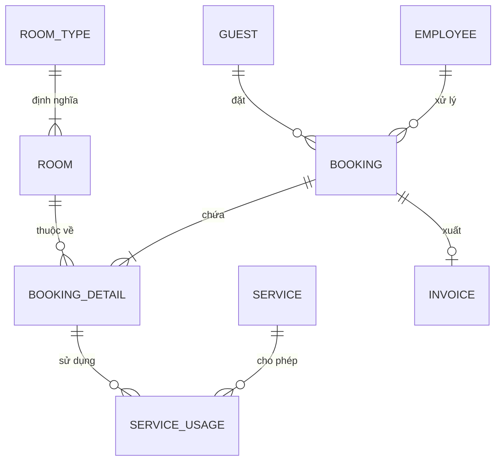

# BÁO CÁO CHI TIẾT THIẾT KẾ CƠ SỞ DỮ LIỆU
**Môn học:** Cơ sở dữ liệu (DBI202)
**Hệ thống:** Quản lý Khách sạn cao cấp (COMUA Hotel)
**Hệ quản trị CSDL:** Microsoft SQL Server

---

## 1. TỔNG QUAN KIẾN TRÚC DỮ LIỆU (DATABASE OVERVIEW)

Hệ thống được thiết kế theo mô hình **Relational Database Management System (RDBMS)**, tuân thủ nghiêm ngặt các dạng chuẩn hóa (Normalization) để tránh dư thừa và đảm bảo tính toàn vẹn dữ liệu. 

Triết lý thiết kế của hệ thống là **"Logic-in-Database"**: chuyển phần lớn các quy trình nghiệp vụ cốt lõi, ràng buộc dữ liệu (Constraints), và các phép tính toán tài chính (Hóa đơn, Dịch vụ) xuống xử lý trực tiếp tại SQL Server bằng Stored Procedures và Transactions. Điều này giúp:
- Đảm bảo độ an toàn tuyệt đối khi nhiều nhân viên thao tác cùng lúc (Concurrency Control).
- Giữ vững tính nguyên tử (Atomicity) của giao dịch tiền bạc.
- Giảm tải cho phía backend (Node.js).

---

## 2. SƠ ĐỒ THỰC THỂ KẾT HỢP (ERD & SCHEMA DESIGN)

Hệ thống gồm **9 bảng (Tables)** được liên kết với nhau thông qua các Khóa chính (Primary Key) và Khóa ngoại (Foreign Key) chặt chẽ.



### 2.1. Quản lý Phòng & Loại Phòng
- **`ROOM_TYPE`**: Chứa thông tin các hạng phòng (Standard, Deluxe, Penthouse,...), sức chứa (`max_capacity`) và giá gốc (`base_price`).
  - *Ràng buộc:* `CHECK (base_price >= 0)` để đảm bảo giá không bị âm.
- **`ROOM`**: Thông tin cụ thể từng phòng (ví dụ: Phòng 101, Phòng Penthouse 501).
  - Khóa ngoại: Tham chiếu tới `ROOM_TYPE`.
  - Cột `status`: Có ràng buộc `CHECK (status IN ('Clean', 'Dirty', 'Maintenance', 'Occupied'))` giúp giới hạn đúng 4 trạng thái vận hành chuẩn của khách sạn.
  - Cột `room_number`: Gắn `UNIQUE` để tránh nhập trùng số phòng.

### 2.2. Quản lý Nhân sự & Khách hàng
- **`GUEST`**: Lưu trữ thông tin khách hàng (Tên, Email, SĐT, Quốc tịch).
  - Ràng buộc: `UNIQUE (id_card)` để đảm bảo mỗi CMND/CCCD hoặc Hộ chiếu là duy nhất.
- **`EMPLOYEE`**: Phân quyền hệ thống gồm `Admin`, `Manager`, `Receptionist`, `Housekeeper`. Hệ thống lưu mật khẩu dạng ẩn `password_hash` và kiểm tra trùng lặp qua `UNIQUE (username)`.

### 2.3. Quy trình Đặt phòng & Tiêu dùng (Core Logic)
Hệ thống sử dụng mô hình **1 Booking - Multiple Details** (1 Đơn đặt phòng có thể đặt cùng lúc nhiều phòng).
- **`BOOKING`**: Đơn đặt phòng tổng quát. Chứa tổng tiền cọc (`total_deposit`) và khoảng thời gian dự kiến.
  - *Business Rule:* `CHECK (expected_checkout > expected_checkin)` (Ngày đi bắt buộc phải sau ngày đến).
- **`BOOKING_DETAIL`**: Lưu trạng thái chi tiết của từng phòng trong đơn đặt.
  - Cột `price_at_booking`: **Cực kỳ quan trọng.** Lưu lại giá phòng tại thời điểm đặt. Dù sau này khách sạn có tăng giá trên bảng `ROOM_TYPE`, khách hàng cũ vẫn được giữ nguyên mức giá cũ.
  - Lưu thời gian khách thực tế nhận/trả phòng (`actual_checkin`, `actual_checkout`).

### 2.4. Dịch vụ & Hóa đơn
- **`SERVICE`**: Danh mục dịch vụ khách sạn (Giặt ủi, Spa, Minibar,...).
- **`SERVICE_USAGE`**: Nhật ký sử dụng dịch vụ của từng phòng (tham chiếu vào `BOOKING_DETAIL`). Lưu giá trị `total_price` bằng cách nhân trực tiếp số lượng và đơn giá từ bảng cấu hình.
- **`INVOICE`**: Hóa đơn thanh toán cuối cùng, thiết lập quan hệ 1-1 với `BOOKING` thông qua `UNIQUE (booking_id)`. Tự động lưu `room_charge` (tiền phòng) và `service_charge` (tiền dịch vụ).

---

## 3. LẬP TRÌNH CƠ SỞ DỮ LIỆU (STORED PROCEDURES & TRANSACTIONS)

Toàn bộ nghiệp vụ (hơn 30 functions) được chuyển thành Stored Procedures nhằm bảo mật mã nguồn và tăng tốc độ xử lý. Dưới đây là những Procedure phức tạp mang tính **nghiệp vụ cốt lõi**:

### 3.1. Nghiệp vụ Check-In (Nhận phòng)
Sử dụng `BEGIN TRANSACTION` để đảm bảo khi khách lấy chìa khóa, 2 sự kiện diễn ra đồng bộ:
1. Chuyển trạng thái phòng thành `Occupied` (đang có người ở), không ai được đặt chồng lên.
2. Lưu giờ tới thực tế vào `actual_checkin`.
3. Đổi trạng thái lịch đặt thành `Confirmed`.
Nếu kết nối rớt giữa chừng, lệnh `ROLLBACK` sẽ chạy để hủy toàn bộ, đảm bảo tính nguyên tử (ACID).

### 3.2. Nghiệp vụ Phát sinh Dịch vụ (`sp_AddServiceUsage`)
Thay vì để Frontend/Backend gửi số tiền tổng lên (rất dễ bị hacker dùng công cụ như Postman can thiệp đổi giá thành 0), Stored Procedure chỉ nhận Số Lượng (`@quantity`) và ID Dịch vụ (`@service_id`). SQL Server sẽ tự chạy lệnh:
```sql
SELECT @quantity * unit_price FROM SERVICE WHERE service_id = @service_id;
```
Điều này đảm bảo **tính toàn vẹn dữ liệu tài chính**, không thể bị thao túng từ bên ngoài.

### 3.3. Nghiệp vụ Tổng kết Hóa đơn (`sp_GenerateInvoice`)
Quy trình thanh toán (Check-out/Billing) tự động gom và tính tiền:
- Nhóm toàn bộ tiền phòng bằng hàm aggregate `SUM(price_at_booking)`.
- Kết nối `JOIN` bảng sử dụng dịch vụ thông qua `detail_id` để `SUM` toàn bộ tiền ăn uống/giặt ủi.
- Tự động cộng Thuế VAT 10% và trừ đi `%` giảm giá.
- Đổi trạng thái Booking thành `Completed` và sinh hóa đơn. Mọi thứ được gói gọn trong 1 Transaction bảo mật cao.

### 3.4. Xử lý Lỗi Tùy Chỉnh (Custom Hard-Errors)
Khi xóa các thực thể có ràng buộc lịch sử (ví dụ: Xóa một nhân viên, Xóa một phòng đang có khách, Xóa dịch vụ đã từng bán), SQL Server dùng hàm `THROW` để chặn đứng thao tác và ném ra các mã lỗi tùy chỉnh (50001, 50002...).
```sql
IF EXISTS (SELECT 1 FROM BOOKING_DETAIL WHERE room_id = @room_id)
    THROW 50001, N'Phòng này đã từng có khách đặt hoặc đang ở, không thể xóa để đảm bảo toàn vẹn dữ liệu.', 1;
```

---

## 4. TỐI ƯU HÓA HIỆU NĂNG (INDEXING & VIEWS)

Để đáp ứng được quy mô dữ liệu lớn mà không bị sụt giảm tốc độ truy xuất, các phương pháp Database Tuning đã được áp dụng.

### 4.1. Non-Clustered Indexes
Ngoài Clustered Index (theo các Primary Key), hệ thống tạo 9 Non-Clustered Index:
- `IX_ROOM_status`: Giúp tìm kiếm các phòng trống (`Clean`) cực nhanh trong thời gian cao điểm.
- `IX_BOOKING_status`: Tối ưu câu lệnh lọc lịch đặt phòng (Pending/Confirmed).
- Các Index trên Foreign Key (`guest_id`, `emp_id`, `room_id`) để tốc độ `JOIN` diễn ra tức thời (O(log n) thay vì thao tác Scan tuyến tính).

### 4.2. Reporting Views
Tạo các khung nhìn (View) để bộ phận phân tích dữ liệu dễ dàng làm Dashboard:
- `vw_RoomStatus`: Nối dữ liệu `ROOM` và `ROOM_TYPE` để thấy cái nhìn tổng quan của bảng trạng thái buồng phòng, bao gồm cả loại phòng và giá.
- `vw_ActiveBookings`: Chỉ hiển thị khách hàng đang có giao dịch (Pending/Confirmed).

### 4.3. Quản lý Bộ đệm Khóa Tự Tăng (Identity Cache)
Lệnh `ALTER DATABASE SCOPED CONFIGURATION SET IDENTITY_CACHE = OFF` được thiết lập. Điều này giúp ngăn chặn tình trạng "nhảy cóc ID" (ví dụ từ #8 nhảy lên #1001) mỗi khi máy chủ database bị reboot, đảm bảo sự tuần tự tuyến tính trên giao diện phần mềm dành cho người học và giám đốc khách sạn.

---
**Tổng kết:** Cơ sở dữ liệu của dự án COMUA Hotel không chỉ đáp ứng lưu trữ thuần túy mà còn gánh vác các Logic nghiệp vụ ở mức độ lõi, đảm bảo an ninh, tính nguyên tử trong quản trị tiền nong của khách sạn.
