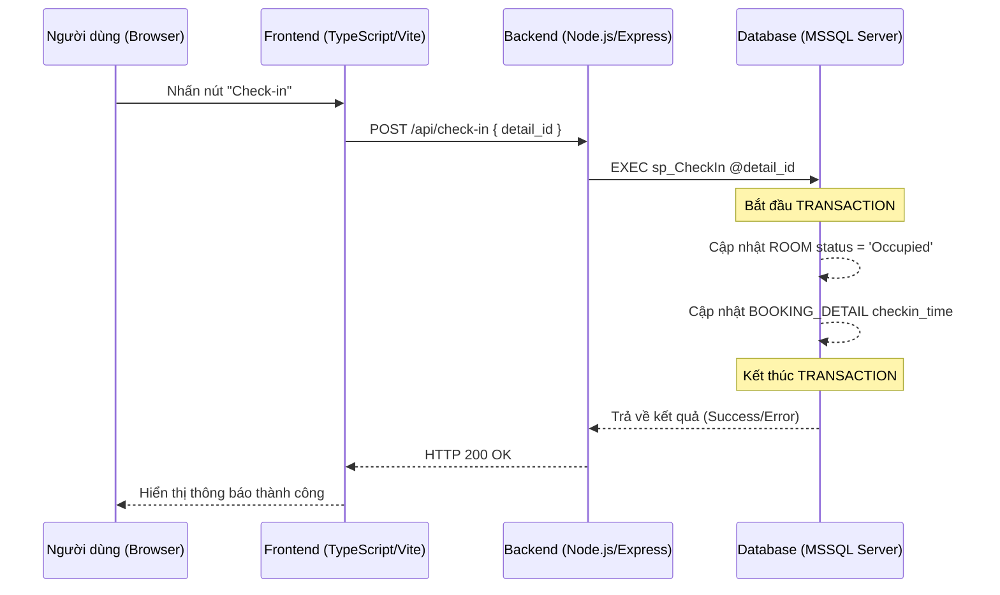
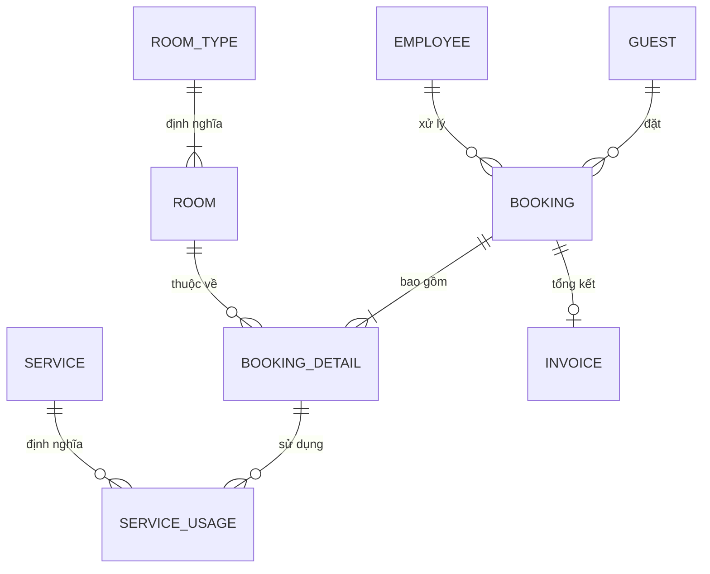

# Báo Cáo Kỹ Thuật Tổng Thể: Hệ Thống Quản Lý Khách Sạn (Full-Stack)

## 1. Kiến Trúc Hệ Thống (Architectural Overview)

Dự án được xây dựng trên triết lý **"Logic-in-Database"**. Điều này có nghĩa là mọi quy tắc nghiệp vụ, tính toán tiền bạc và ràng buộc dữ liệu đều được thực hiện bởi SQL Server. Các tầng còn lại (Backend/Frontend) chỉ đóng vai trò hiển thị và truyền dẫn.

### 1.1. Sơ đồ luồng hoạt động (System Flow)


---

## 2. Thiết Kế Cơ Sở Dữ Liệu Chi Tiết

### 2.1. Sơ đồ quan hệ thực thể (ER Diagram)


---

## 3. Giải Thích Chi Tiết Các File Core (Deep Dive)

### 3.1. Database: `stored_procedures.sql`
Đây là nơi chứa toàn bộ "linh hồn" của hệ thống. Thay vì viết SQL trong code Node.js, chúng ta đóng gói chúng vào các thủ tục (Procedures) để tăng tính bảo mật và hiệu năng.

- **`sp_CheckIn` & `sp_CheckOut`**: 
    - Hai thủ tục này sử dụng `BEGIN TRANSACTION` để đảm bảo tính nguyên tử. Khi Check-in, hệ thống phải cập nhật bảng `BOOKING_DETAIL` (thời gian thực tế) và bảng `ROOM` (trạng thái 'Occupied') cùng một lúc. Nếu một lệnh lỗi, toàn bộ quá trình sẽ được `ROLLBACK`.
- **`sp_GenerateInvoice`**: 
    - Đây là thủ tục phức tạp nhất. Nó tự động xóa hóa đơn cũ (nếu có) để cập nhật dữ liệu mới nhất.
    - Nó tính toán `room_charge` bằng cách `SUM` đơn giá phòng từ `BOOKING_DETAIL`.
    - Nó tính toán `service_charge` bằng cách `JOIN` giữa `SERVICE_USAGE` và `BOOKING_DETAIL`.
    - Cuối cùng, nó tính Thuế VAT 10% và trả về số tiền cuối cùng cho Backend.
- **Ràng buộc bảo vệ (`THROW`)**:
    - Ví dụ trong `sp_DeleteRoom`, chúng ta kiểm tra `IF EXISTS` khách đã từng ở phòng đó chưa. Nếu rồi, hệ thống sẽ ném lỗi `50001` thay vì để SQL ném lỗi hệ thống khó hiểu. Điều này giúp bảo vệ lịch sử hóa đơn.

### 3.2. Server: `src/db.ts` (Quản lý kết nối)
File này chịu trách nhiệm thiết lập "đường ống" dẫn tới SQL Server.
- **`mssql.ConnectionPool`**: Thay vì tạo kết nối mới mỗi khi có người truy cập (rất chậm), chúng ta tạo một "hồ chứa" kết nối (Pool). Khi cần dùng, backend mượn một kết nối từ hồ này và trả lại sau khi dùng xong.
- **`dotenv.config()`**: Cho phép đọc các thông số bảo mật (user, password) từ file `.env`, tránh lộ thông tin khi up code lên GitHub.
- **`trustServerCertificate`**: Cấu hình quan trọng để cho phép kết nối an toàn với SQL Server trên môi trường local mà không cần chứng chỉ SSL phức tạp.

### 3.3. Server: `src/index.ts` (Điều phối API)
File này là bộ khung của Backend Express. Nó không chứa logic tính toán, chỉ chứa các "cổng chào" (Endpoints).
- **Tính đồng nhất**: Tất cả các route đều tuân theo mô hình:
    1. Nhận dữ liệu từ `req.body` hoặc `req.params`.
    2. Gọi `(await poolPromise).request()`.
    3. Gán tham số bằng `request.input()`. Việc này cực kỳ quan trọng vì nó **ngăn chặn SQL Injection** 100%.
    4. Thực thi bằng `request.execute('tên_SP')`.
- **Xử lý lỗi thông minh**: Hệ thống sử dụng khối `try...catch`. Nếu SQL ném lỗi nghiệp vụ (như lỗi 50001 ở trên), Backend sẽ bắt được và gửi về Frontend mã lỗi phù hợp kèm lời nhắn tiếng Việt.

---

## 4. Phân Tích Chi Tiết Tầng Giao Diện (`/src`)

### 4.1. Quản lý trạng thái (State Management)
- **`src/data.ts`**: Chứa biến toàn cục `DB`. Mỗi khi có thay đổi (thêm phòng, xóa khách), hàm `fetchDB()` sẽ được gọi để đồng bộ lại toàn bộ dữ liệu từ SQL về RAM của trình duyệt, đảm bảo giao diện luôn mới nhất.

### 4.2. Chi tiết các trang (`/src/pages`)
- **`bookings.ts`**: 
    - Hàm `renderBookings()`: Chuyển đổi mảng `DB.bookings` thành các thẻ `<tr>`.
    - Logic `Add Booking`: Hiển thị một Modal. Khi người dùng chọn phòng, nó kiểm tra trạng thái phòng trong `DB.rooms`. Khi nhấn Lưu, nó gọi `apiPost` để "nhờ" backend thực thi SP tại database.
- **`invoices.ts`**:
    - Chứa logic **In ấn hóa đơn**. Nó tạo ra một thẻ `div` ẩn, đổ dữ liệu hóa đơn vào theo template HTML/CSS chuẩn, sau đó gọi `window.print()` của trình duyệt.
    - Chức năng **Preview**: Khi bạn chọn một mã Booking để tạo hóa đơn, code JS sẽ tự tính nhẩm các con số để hiển thị cho bạn xem trước, nhưng con số cuối cùng vẫn do SQL quyết định khi lưu chính thức.

---

## 5. Minh Họa Chi Tiết: Quy Trình Check-in (End-to-End)

Để hiểu rõ cách hệ thống vận hành, hãy cùng phân tích luồng dữ liệu của tính năng **Check-in** (Nhận phòng) xuyên suốt từ Database đến Giao diện.

### 5.1. Tầng Database (Lõi xử lý)
Trong `database/stored_procedures.sql`, thủ tục `sp_CheckIn` quản lý toàn bộ logic nghiệp vụ:
```sql
CREATE OR ALTER PROCEDURE sp_CheckIn
    @detail_id  INT -- Nhận vào ID chi tiết đặt phòng
AS
BEGIN
    BEGIN TRANSACTION; -- Đảm bảo an toàn dữ liệu
    BEGIN TRY
        -- 1. Ghi nhận thời gian khách vào phòng thực tế
        UPDATE BOOKING_DETAIL SET actual_checkin = GETDATE() WHERE detail_id = @detail_id;
        
        -- 2. Tìm ID phòng và ID đơn đặt tương ứng
        DECLARE @room_id INT, @booking_id INT;
        SELECT @room_id = room_id, @booking_id = booking_id FROM BOOKING_DETAIL WHERE detail_id = @detail_id;

        -- 3. Cập nhật trạng thái phòng thành 'Occupied' (Đang ở)
        UPDATE ROOM SET status = N'Occupied' WHERE room_id = @room_id;

        -- 4. Nếu đơn đặt đang ở trạng thái 'Pending', chuyển sang 'Confirmed'
        UPDATE BOOKING SET status = N'Confirmed'
        WHERE booking_id = @booking_id AND status = N'Pending';

        COMMIT TRANSACTION; -- Hoàn tất nếu không có lỗi
    END TRY
    BEGIN CATCH
        ROLLBACK TRANSACTION; -- Hủy bỏ toàn bộ nếu xảy ra lỗi bất kỳ
        THROW; -- Ném lỗi về cho Backend
    END CATCH;
END;
```

### 5.2. Tầng Backend (Cầu nối)
Trong `server/src/index.ts`, Route nhận yêu cầu từ Web và chuyển tiếp tới SQL:
```typescript
app.post('/api/check-in', async (req, res) => {
    const { detail_id } = req.body; // Lấy ID từ client
    try {
        await (await poolPromise).request()
            .input('detail_id', mssql.Int, detail_id) // Gán tham số an toàn
            .execute('sp_CheckIn'); // Thực thi procedure tại DB
        res.json({ success: true }); // Trả về kết quả thành công
    } catch (err) { 
        res.status(500).send(err); // Trả về lỗi nếu SQL ném lỗi
    }
});
```

### 5.3. Tầng Frontend (Giao diện người dùng)
Trong `src/pages/bookings.ts`, khi nhân viên nhấn nút "Confirm/Check-in":
```typescript
// 1. Gọi hàm API đã được đóng gói sẵn
await apiPost('/bookings/confirm', { booking_id: bid });

// 2. Load lại dữ liệu mới nhất từ server để cập nhật giao diện
await fetchDB(); 

// 3. Hiển thị thông báo Toast mượt mà
showToast(`Xác nhận thành công!`, 'success');
```

---

## 6. Luồng Nghiệp Vụ "Hơi Thở" Của Hệ Thống

### 5.1. Từ "Đặt Phòng" đến "Trả Phòng"
1.  **Giai đoạn 1 (Booking):** Nhân viên tạo đơn. Trạng thái là `Pending`. Phòng vẫn hiện là `Clean`.
2.  **Giai đoạn 2 (Check-in):** Khi khách đến, gọi `sp_CheckIn`. SQL cập nhật trạng thái phòng sang `Occupied` ngay lập tức. Lúc này, không ai khác có thể đặt phòng này nữa.
3.  **Giai đoạn 3 (Service):** Trong quá trình ở, khách dùng nước ngọt. Nhân viên gọi `sp_AddServiceUsage`. Dữ liệu ghi vào bảng nhật ký dùng dịch vụ.
4.  **Giai đoạn 4 (Check-out):** Gọi `sp_GenerateInvoice`. SQL tính tổng tất cả chi phí. Sau khi hoàn tất, phòng tự động về trạng thái `Dirty` để báo cho nhân viên dọn dẹp (Housekeeper) biết cần phải làm việc.

---

## 6. Các Công Nghệ Trợ Lực
- **Vite:** Công cụ build siêu tốc, giúp frontend load cực nhanh trong quá trình phát triển.
- **TypeScript:** Giúp phát hiện lỗi logic ngay khi đang viết code (ví dụ: nhầm lẫn giữa `room_id` và `room_number`).
- **Glassmorphism:** Sử dụng `backdrop-filter: blur()` trong CSS để tạo giao diện hiện đại, trong suốt như kính.

---

## 7. Phụ Lục Kỹ Thuật: Chi Tiết Tầng Dữ Liệu (SQL Deep Dive)

Phần này cung cấp cái nhìn chi tiết nhất về cấu trúc bảng, các ràng buộc và tối ưu hóa hiệu năng tại SQL Server.

### 7.1. Chi tiết các bảng và Ràng buộc (Schema & Constraints)

Hệ thống sử dụng các kiểu dữ liệu tối ưu và ràng buộc chặt chẽ để đảm bảo dữ liệu luôn "sạch":

| Tên Bảng | Cột Khóa Chính | Ràng buộc quan trọng | Ý nghĩa kỹ thuật |
| :--- | :--- | :--- | :--- |
| **ROOM_TYPE** | `type_id` | `CHECK (base_price >= 0)` | Đảm bảo giá phòng không bao giờ âm. |
| **ROOM** | `room_id` | `UNIQUE (room_number)` | Ngăn chặn việc trùng lặp số phòng trong hệ thống. |
| **GUEST** | `guest_id` | `UNIQUE (id_card)` | Mỗi khách hàng được định danh duy nhất qua CMND/CCCD. |
| **BOOKING** | `booking_id` | `CHECK (checkout > checkin)` | Ràng buộc logic: Ngày đi phải sau ngày đến. |
| **INVOICE** | `invoice_id` | `UNIQUE (booking_id)` | Đảm bảo mỗi đơn đặt phòng chỉ có tối đa một hóa đơn thanh toán. |

### 7.2. Tối ưu hóa hiệu năng với Index
Để đảm bảo hệ thống vẫn chạy nhanh khi dữ liệu lên tới hàng triệu bản ghi, các Index sau đã được thiết lập:
- **`IX_ROOM_status`**: Tăng tốc độ lọc danh sách "Phòng trống" hoặc "Phòng bẩn" tại Dashboard.
- **`IX_BOOKING_status`**: Tối ưu cho việc hiển thị các đơn đặt phòng `Pending` hoặc `Confirmed`.
- **`IX_BD_booking_id`**: Giúp việc truy xuất chi tiết phòng của một đơn đặt phòng diễn ra tức thì.
- **`IX_SU_detail_id`**: Tối ưu luồng tính tiền dịch vụ khi làm thủ tục Check-out.

### 7.3. Các View Báo Cáo (Views)
Hệ thống cung cấp sẵn các "Cửa sổ dữ liệu" giúp lập trình viên Frontend lấy dữ liệu nhanh mà không cần viết lệnh `JOIN` phức tạp:
1.  **`vw_RoomStatus`**: Kết hợp bảng `ROOM` và `ROOM_TYPE` để hiển thị sơ đồ phòng kèm loại phòng và giá cả.
2.  **`vw_ActiveBookings`**: Lọc nhanh các đơn đặt phòng đang hoạt động (chưa hoàn thành/hủy) để hiển thị tại trang danh sách.

### 7.4. Phân tích Logic Procedure `sp_AddServiceUsage`
Thủ tục này minh họa cho việc "Tính toán tại nguồn":
```sql
CREATE OR ALTER PROCEDURE sp_AddServiceUsage
    @detail_id      INT,
    @service_id     INT,
    @quantity       INT
AS
BEGIN
    -- Lấy đơn giá trực tiếp từ bảng gốc để nhân với số lượng
    INSERT INTO SERVICE_USAGE (booking_detail_id, service_id, quantity, used_at, total_price)
    SELECT @detail_id, @service_id, @quantity, GETDATE(), @quantity * unit_price
    FROM SERVICE WHERE service_id = @service_id;
END;
```
*Tại sao làm vậy?* Vì nếu Frontend gửi cả số tiền lên, kẻ xấu có thể can thiệp để sửa giá. Việc lấy giá trực tiếp từ bảng `SERVICE` tại DB giúp ngăn chặn hoàn toàn gian lận.

---
*Bản báo cáo này được thiết kế để cung cấp cái nhìn xuyên thấu từ những dòng code SQL đến những pixel hiển thị trên màn hình người dùng.*
